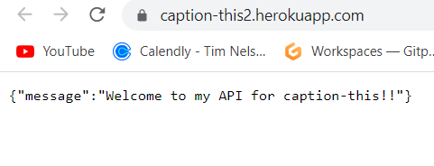

# API For 'Caption This'

The backend API based on Django Rest Framework (DRF), to complete the final project (PP5- Advanced front-end) for Code Institute. Together with the front-end React based project, which you can find here [here](https://caption-this-react.herokuapp.com/), let's the user use the full CRUD functionality (Create, Read, Update & Delete).

The various pages of this API are visible to anyone who enters these URLs:

* /accounts/

* /posts/

* /likes/

* /comments/

* /dj-rest-auth/user

Visit the deployed application [here](https://caption-this-react.herokuapp.com/).

## Table of Contents

1. [User Experience (UX)](#user-experience-ux)
   1. [Strategy](#strategy)
      1. [Project Goals](#project-goals)
      2. [User Goals](#user-goals)
      3. [Strategy](#strategy)
3. [Features](#features)
4. [Technologies Used](#technologies-used)
   1. [Languages Used](#languages-used)
   2. [Libraries and Frameworks](#libraries-and-frameworks)
   4. [Database Management](#database-management)
    1. [Database Model](#database-model)
   6. [Cloud Storage](#cloud-storage)
   7. [Tools and Programs](#tools-and-programs)
5. [Testing](#testing)
    1. [Go to TESTING.md](https://github.com/Hemenhk/locations/blob/main/TESTING.md)
6. [Deployment](#deployment)
    1. [How To Use This Project](#how-to-use-this-project)  
    2. [Deployment to Heroku](#deployment-to-heroku)   
7. [Credits](#credits)
    1. [Media](#media)  
    2. [Code](#code)   
8. [Known Bugs](#known-bugs)
9. [Acknowledgements](#acknowledgements)

## User Experience (UX)

### Strategy

#### Project Goals

- Since this project is 50% of the full project, it's main purpose was to provide an functional API based system to provide the user with a functioning communication.

#### User Goals

- As a user I want to be able to view all posts and individual ones.

- As a user I want to be able to view all profiles and individual ones.

- As a user I want to be able to view all ratings and individual ones.

- As a user I want to be able to view all reviews and individual ones.

- As a superuser, I want full CRUD functionality in the Django Rest Framework when developing the API.

### Strategy

To achieve the user goals, I wish to implement the following features:

* An URL for users to view all posts and by id

* An URL for users to view all accounts and by id

* An URL for users to view all likes and by id

* An URL for users to view all reviews and by id

## Features

* Through the Django Rest Framework and CI DRF-API module, this fully functioning CRUD was able to deliver its main tasks. The superuser can through a form, fill and submit and finally use the CRUD-functionality without any problem.

## Technologies Used
- Django

     The main framework which was used to create this application

- Django REST Framework (DRF)
 
    The django based framework was used to create the API

- Cloudinary
    
     Platform to store/host the static images

- Heroku
    
     With heroku, this application had a place to be hosted

- Git
    
     Used for version control

- Github
    
     Github was used to store the docs and as a code base

### Languages Used

- [Python](https://www.python.org/)

### Libraries and Frameworks

- [Django](https://www.djangoproject.com/) was used to build the app.

- [Django Rest Framework](https://www.django-rest-framework.org/) was used to build the API.

- [Django Allauth](https://django-allauth.readthedocs.io/) was used for authentication, registration and account management.

- [Django Rest Auth](https://dj-rest-auth.readthedocs.io/) was also used for registration and authentication.

- [Corsheaders](https://pypi.org/project/django-cors-headers/) was to access the API from the front end during and after development.

- [Google Fonts](https://fonts.google.com) was used to import fonts to the HTML file, and used throughout the project.

- [Font Awesome](https://fontawesome.com) was used to add icons to various links.

### Database Management

#### Database Model

The databse model was designed using [drawsql](https://drawsql.app/) The type of databases being used are SQLite3 during development, and [PostgreSQL](https://www.postgresql.org/).

- [SQLite](https://www.sqlite.com/index.html) database was used as the database during the development.

- [ElephantSQL - Postgres](https://www.elephantsql.com/) database was used in production, based on Postgres and provided by ElephantSQL.

### Cloud Storage

- [Cloudinary](https://cloudinary.com/) was used to store static and media files.

### Tools and Programs

- [Git](https://git-scm.com)

- [GitPod](https://gitpod.io/)

- [GitHub](https://github.com/)

- [Heroku](https://heroku.com)

- [Chrome DevTools](https://developer.chrome.com/docs/devtools/) was used during development to debug the app.

- [W3C Markup Validator](https://validator.w3.org/) was used to validate custom CSS code.

- [Favicon.io](https://favicon.io) was used to add a custom favicon.

## Testing

The testing documentation for this project can be found [here]

## Deployment

The project was deployed using [GitPod](https://gitpod.io/). All code was commited to [Git](https://git-scm.com) and then pushed on to [GitHub](https://github.com/) using the terminal in [GitPod](https://gitpod.io/). The application is deployed on Heroku.

### How To Use This Project

To use this project, one can either fork or clone the repository.

#### Forking

By forking this repository you copy the original to view and make changes to the code, without affecting the original repository by following these steps:

1. Log into your GitHub account.
2. Navigate to the repository and in the upper-right corner, click on "Fork".
3. In the "Create a new fork" page, press the "Create fork" button.
4. To edit the code, click on the "Gitpod" button to launch your own workspace.
5. Changes in the new repository can be merged with the original via a pull request.

#### Clone GitHub Repository

By cloning the GitHub repository, you can create a local copy of the original on your own system. To clone this repository follow these steps:

1. Log into your GitHub account.
2. Navigate to the repository and click the dropdown on the "Code" button..
3. To clone using HTTPS, copy the code provided in the field.
4. Open Git Bash and change the current directory to the location where you wish the cloned directory to be made.
5. Type git clone, then paste the URL that you copied.
6. Press Enter, and your local clone is created.

### Deployment To Heroku

This project is deployed using Heroku, with all static files being uploaded to Cloudinary. These are the steps to deploy to Heroku:

1. Log in to your Heroku account.
2. Press "Create new app", and select the desired app name and the region of which you are located, then press "Create app".
3. Press the "Deploy" tab and click on "GitHub" in the "Deployment method" field.
4. In the "Connect to GitHub" section select your profile and search for the repository. When the repository appears, click on "Connect".
5. Go to "Settings" and scroll down to "Config Vars", and click "Reveal Config Vars".
6. Here fill in the following key & values:
    1. ALLOWED_HOST = (https://caption-this-react.herokuapp.com/)
    2. CLIENT_ORIGIN = (https://caption-this-react.herokuapp.com/)
    3. CLIENT_ORIGIN_DEV = (this value may change during the developing process).
    4. CLOUDINARy_URL = cloudinary://(the value beyond is private).
    5. DATABASE_URL = postgres://(the value beyond is private).
    7. SECRET_KEY = (this value is private).
7. After all config vars have been filled make sure "Buildpacks" is set to "heroku/python".
8. Make your way to "Deploy" and scroll down to "Manual deploy".
9. Press "Deploy branch" and when the build is finished, open the app.

## Credits

### Code

- A huge contribution for this code was the fantastic module from Code Institutes Django Rest Framework API. Without it, this particular project would not have been the same. 

## Known Bugs

There are no bugs that I know of.

## Acknowledgements

- My family & loved ones for having patience and showing me support through my coding journey.

- The Code Institute team, without their help & modules, it would have been way harder to build this project. Their tutors, the assistance in the slack community and all the mentors deserve are all a huge contributer to my learning progression.